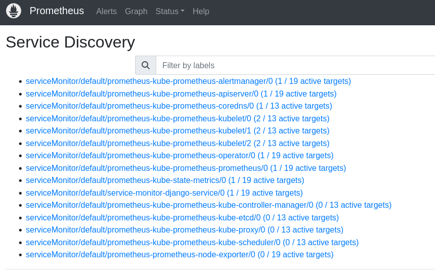

# Monitoring the real world application

## Monitoring

<p>All monitoring is performed by prometheus using a helm chart called <b>prometheus-community/kube-prometheus-stack</b>.
Helm is a package manager for kubernetes. The helm chart will automatically install all packages and configurations you need to monitor your application.
### First we are going to install helm: 
```
sudo curl -fsSL -o get_helm.sh https://raw.githubcontent.com/helm/helm/main/scripts/get-helm-3

sudo chmod 700 get_helm.sh

./get_helm.sh


#### Adding prometheus repo using helm, updating the repo and installing the chart
```
helm repo add prometheus-community https://prometheus-community.github.io/helm-charts

helm repo update

helm install prometheus prometheus-community/kube-prometheus-stack
```

<b> N.B you can use any release name of your choice when installing the chart </b>

After installation, run <b> kubectl get all </b> to see all the pending/running state of the pods, deployment, statefulSet, services, etc.
</p>

 
#### Monitoring the application
<p>

To monitor the application service, We will be using a method called <b> Service discovery </b>that allow prometheus to populate a list of endpoints to scrape that can get dynamically updated as new endpoints get created and destroyed.

Run: <b> $ kubectl apply -f service-monitor-condult.yaml </b>

</p>

#### Viewing prometheus server
<p>

After the installation of the helm chart all services will run on a cluster ip by default. We need to change the prometheus service type to a load balancer or node port to be able to connect to the server.

Edit the prometheus service type and save it in a new file and apply the change. 

The prometheus server will be exposed on any Nodeport Ip or load balancer ip on port <b> 9090</b>

To view if the service of your application has been scraped navigate to the status dropdown and click of service discovery and check for the name of your service application.



</p>
